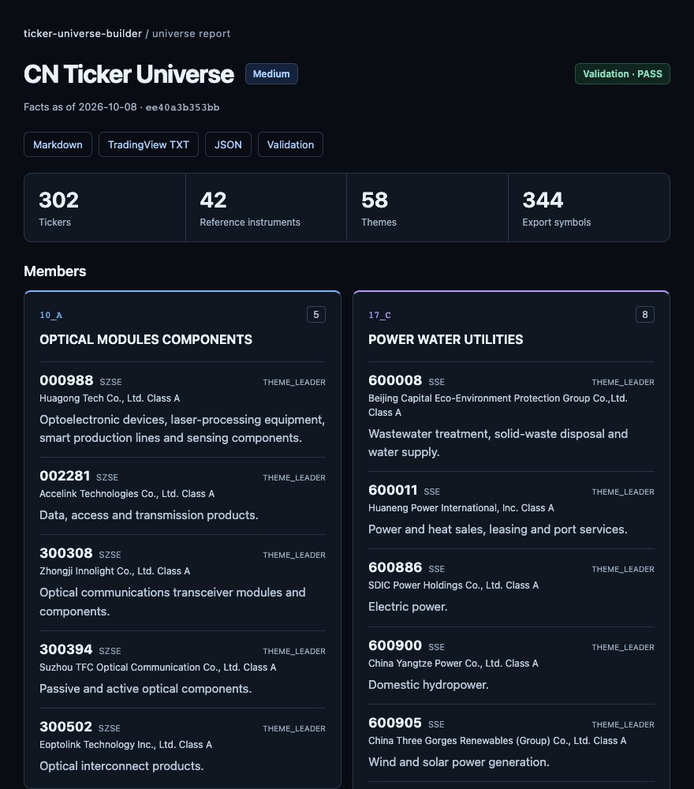
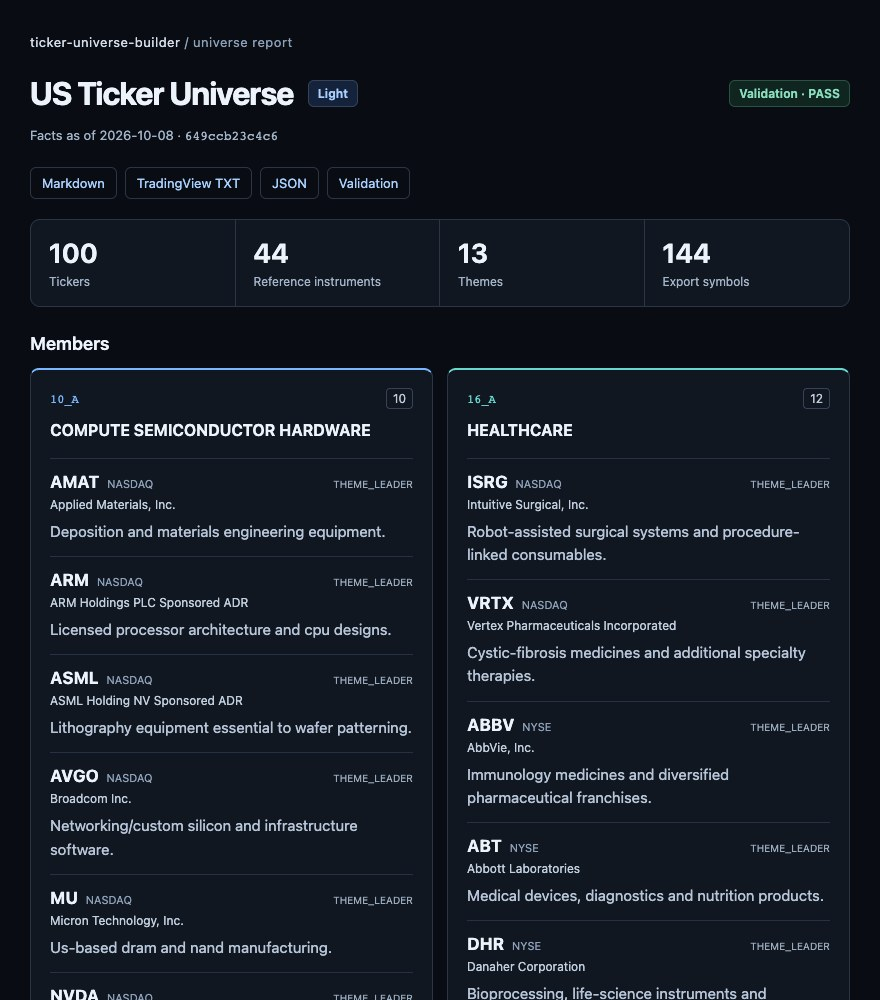
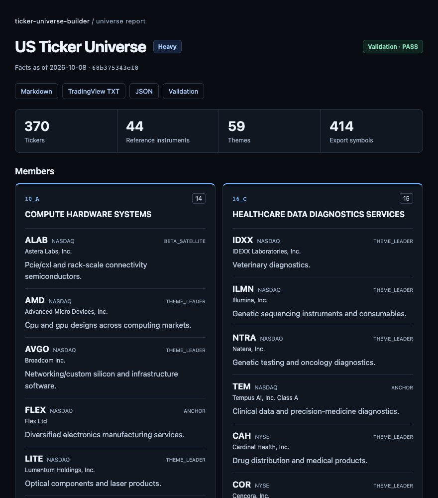
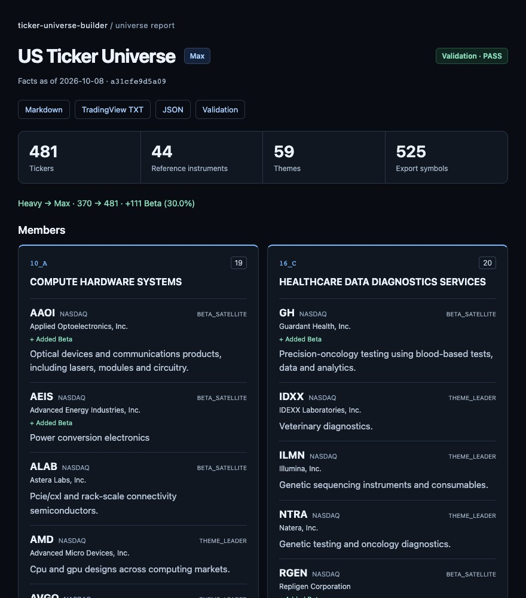
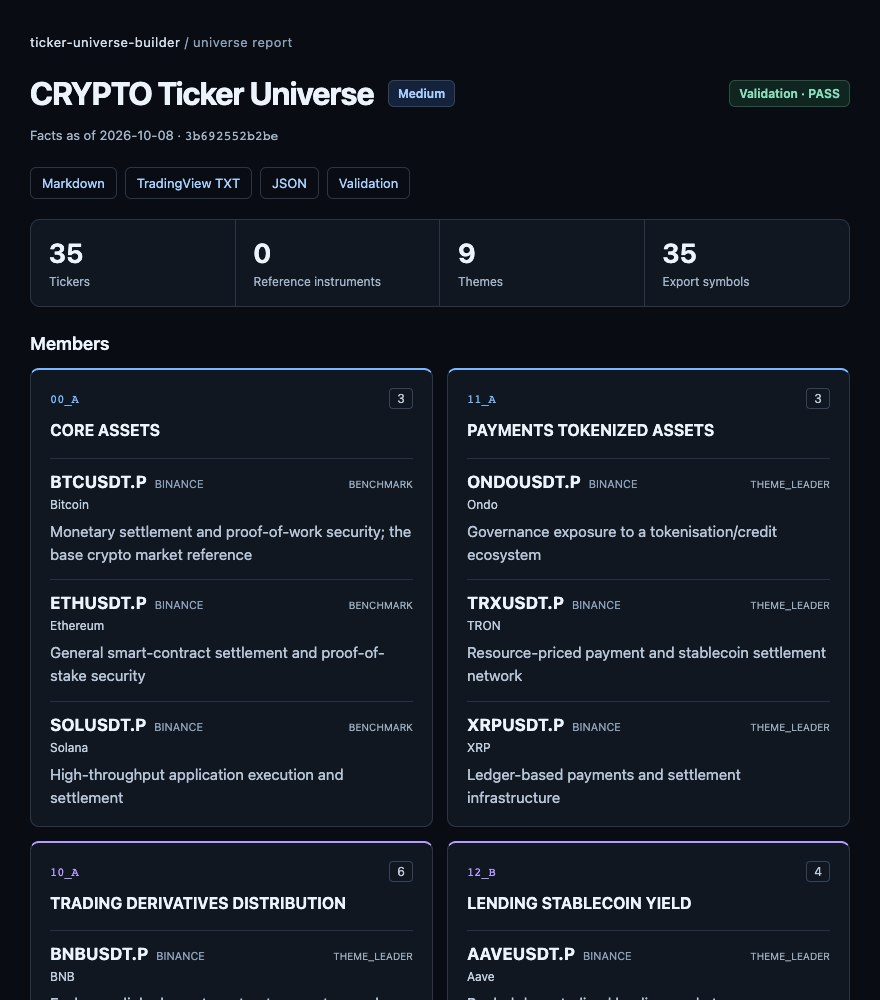
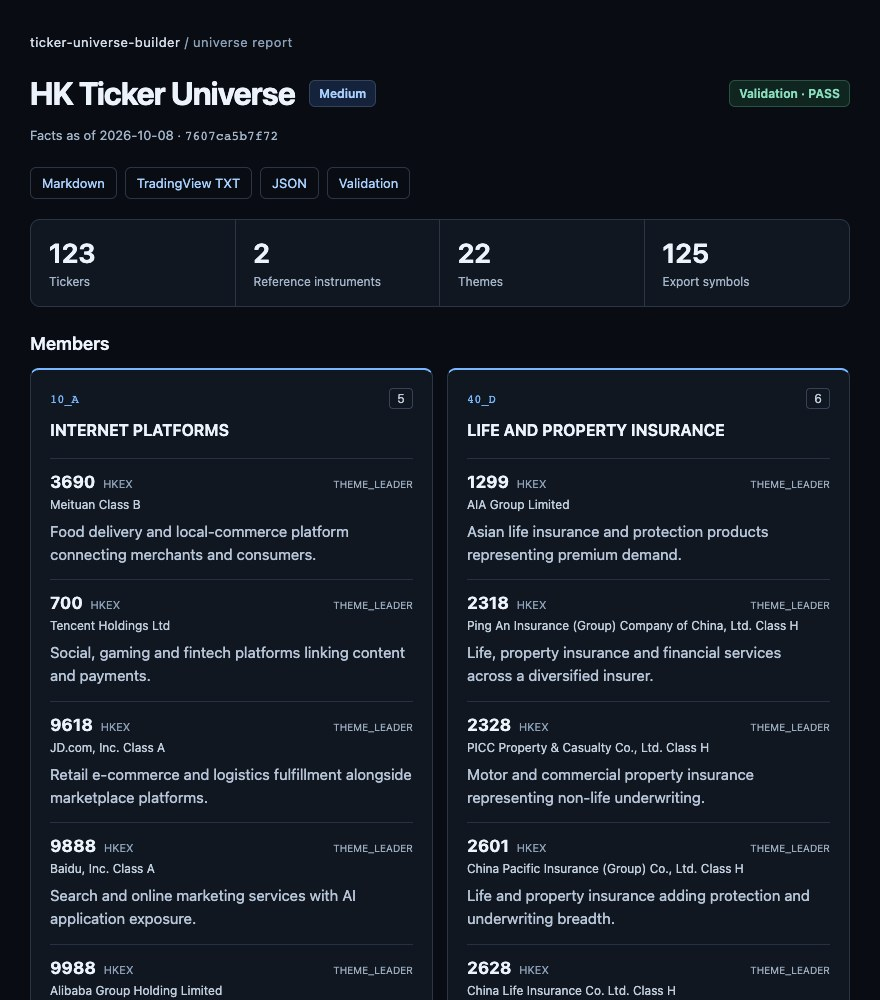
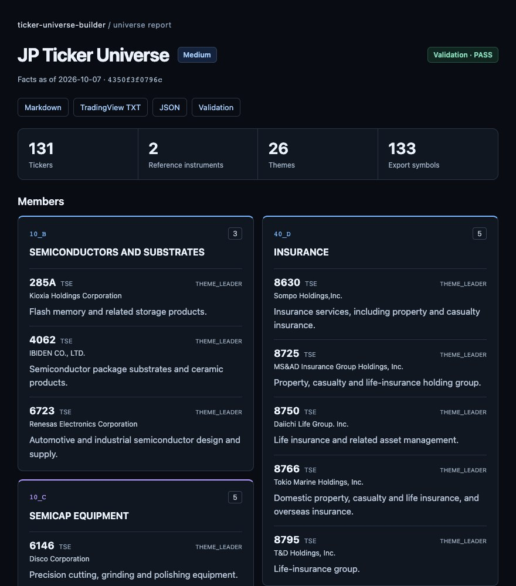
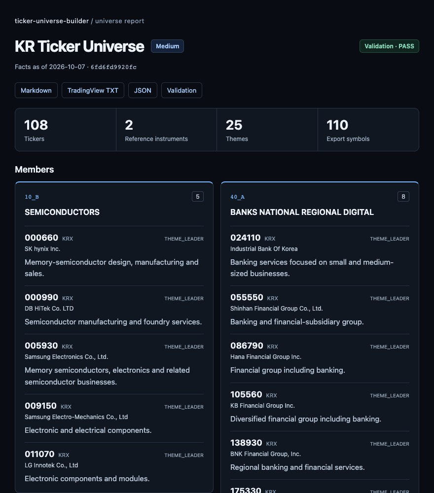
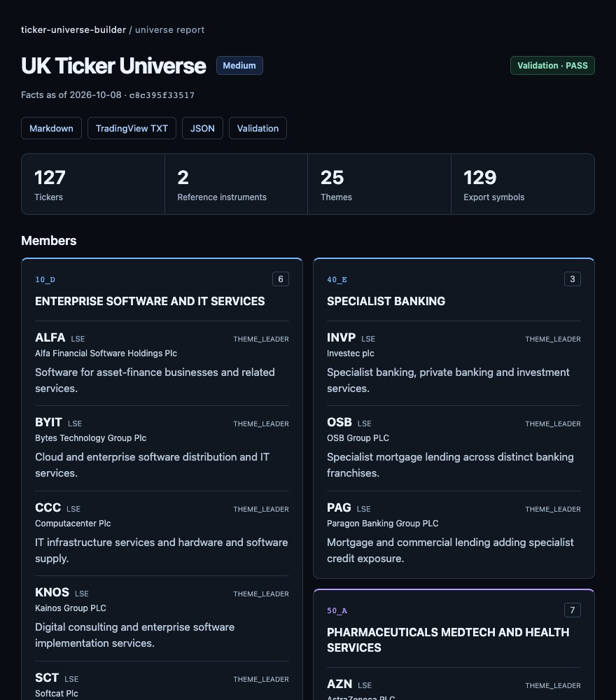

# Worked examples

Ten dated builds with researched inputs and standard artifacts. Full evidence/diagnostics stay
in JSON. Download HTML to view it; GitHub displays source. Preview thumbnails link to full
screenshots, with research notes collapsed. Local images show market-language companions.

| Example | Entities | References | Markdown | HTML | Preview | TradingView |
|---|---:|---:|---|---|---|---|
| CN Medium | 302 | 42 | [English](cn-medium/output/cn-medium-2026-10-08.en.md) / [Local](cn-medium/output/cn-medium-2026-10-08.zh-Hans.md) | [English](cn-medium/output/cn-medium-2026-10-08.en.html) / [Local](cn-medium/output/cn-medium-2026-10-08.zh-Hans.html) | <a href="cn-medium/preview/cn-medium-2026-10-08.en.full.jpg"></a><br>[Local image](cn-medium/preview/cn-medium-2026-10-08.zh-Hans.full.jpg) | [TXT](cn-medium/output/cn-medium-2026-10-08.txt) |
| US Light | 100 | 44 | [English](us-light/output/us-light-2026-10-08.en.md) | [English](us-light/output/us-light-2026-10-08.en.html) | <a href="us-light/preview/us-light-2026-10-08.en.full.jpg"></a> | [TXT](us-light/output/us-light-2026-10-08.txt) |
| US Medium | 294 | 44 | [English](us-medium/output/us-medium-2026-10-08.en.md) | [English](us-medium/output/us-medium-2026-10-08.en.html) | <a href="us-medium/preview/us-medium-2026-10-08.en.full.jpg"></a> | [TXT](us-medium/output/us-medium-2026-10-08.txt) |
| US Heavy | 370 | 44 | [English](us-heavy/output/us-heavy-2026-10-08.en.md) | [English](us-heavy/output/us-heavy-2026-10-08.en.html) | <a href="us-heavy/preview/us-heavy-2026-10-08.en.full.jpg"></a> | [TXT](us-heavy/output/us-heavy-2026-10-08.txt) |
| US Max | 481 | 44 | [English](us-max/output/us-max-2026-10-08.en.md) | [English](us-max/output/us-max-2026-10-08.en.html) | <a href="us-max/preview/us-max-2026-10-08.en.full.jpg"></a> | [TXT](us-max/output/us-max-2026-10-08.txt) |
| Crypto Medium | 35 | 0 | [English](crypto-medium/output/crypto-medium-2026-10-08.en.md) | [English](crypto-medium/output/crypto-medium-2026-10-08.en.html) | <a href="crypto-medium/preview/crypto-medium-2026-10-08.en.full.jpg"></a> | [TXT](crypto-medium/output/crypto-medium-2026-10-08.txt) |
| HK Medium | 123 | 2 | [English](hk-medium/output/hk-medium-2026-10-08.en.md) / [Local](hk-medium/output/hk-medium-2026-10-08.zh-Hant.md) | [English](hk-medium/output/hk-medium-2026-10-08.en.html) / [Local](hk-medium/output/hk-medium-2026-10-08.zh-Hant.html) | <a href="hk-medium/preview/hk-medium-2026-10-08.en.full.jpg"></a><br>[Local image](hk-medium/preview/hk-medium-2026-10-08.zh-Hant.full.jpg) | [TXT](hk-medium/output/hk-medium-2026-10-08.txt) |
| JP Medium | 131 | 2 | [English](jp-medium/output/jp-medium-2026-10-07.en.md) / [Local](jp-medium/output/jp-medium-2026-10-07.ja.md) | [English](jp-medium/output/jp-medium-2026-10-07.en.html) / [Local](jp-medium/output/jp-medium-2026-10-07.ja.html) | <a href="jp-medium/preview/jp-medium-2026-10-07.en.full.jpg"></a><br>[Local image](jp-medium/preview/jp-medium-2026-10-07.ja.full.jpg) | [TXT](jp-medium/output/jp-medium-2026-10-07.txt) |
| KR Medium | 108 | 2 | [English](kr-medium/output/kr-medium-2026-10-07.en.md) / [Local](kr-medium/output/kr-medium-2026-10-07.ko.md) | [English](kr-medium/output/kr-medium-2026-10-07.en.html) / [Local](kr-medium/output/kr-medium-2026-10-07.ko.html) | <a href="kr-medium/preview/kr-medium-2026-10-07.en.full.jpg"></a><br>[Local image](kr-medium/preview/kr-medium-2026-10-07.ko.full.jpg) | [TXT](kr-medium/output/kr-medium-2026-10-07.txt) |
| UK Medium | 127 | 2 | [English](uk-medium/output/uk-medium-2026-10-08.en.md) | [English](uk-medium/output/uk-medium-2026-10-08.en.html) | <a href="uk-medium/preview/uk-medium-2026-10-08.en.full.jpg"></a> | [TXT](uk-medium/output/uk-medium-2026-10-08.txt) |


All US depths share us-medium/snapshot.json; other Medium folders each contain a snapshot/spec.
US Max retains 370 Heavy entities and adds 111 Beta (30%).
[Build summary](build-summary.json) records qualification/hashes;
[input provenance](input-provenance.json) records sources/transformations.

## Rebuild

```bash
python examples/build_examples.py

# Public CLI replay: use new empty destinations.
python scripts/universe.py build --spec examples/us-heavy/build-spec.json \
  --snapshot examples/us-medium/snapshot.json --output temp/example-us-heavy
python scripts/universe.py build --spec examples/us-max/build-spec.json \
  --snapshot examples/us-medium/snapshot.json \
  --seed temp/example-us-heavy/us-heavy-2026-10-08.json --output temp/example-us-max
```

The generator validates all examples before replacing outputs. Replay is offline, not evidence
refresh. Compact ZIPs include inputs; run the generator before inspecting reports.
[Standard outputs](../references/output-artifacts.md).

## Refresh previews

Optional documentation tooling requires Node.js, Playwright and installed Chrome:

```bash
npm install --prefix temp/preview-tools playwright
NODE_PATH="$PWD/temp/preview-tools/node_modules" node examples/render_previews.cjs
```

Captures 14 HTML reports at 880 px, top/full JPEGs and root desktop/mobile previews. It checks
row counts and horizontal overflow; receipt: temp/report-previews/capture-receipt.json.
Previews live separately from output; refresh them when HTML changes.

## Research dates and limits

| Market | Snapshot date | Prices through | Work in this round |
|---|---|---|---|
| CN | 2026-10-08 | 2026-09-30 | Retain completed online research and brief-reason formatting |
| US / Crypto | 2026-10-08 | 2026-10-06 | Use completed online research and add the requested depth examples |
| HK / UK | 2026-10-08 | 2026-10-07 | New online business, financial, valid-quote and historical-price research |
| JP / KR | 2026-10-07 | 2026-09-28 | Restore reviewed business inputs and add brief reasons and English display; listing observations remain dated 2026-09-29 |


HK/UK supplier-code/business corrections: [HK](hk-medium/research-review.json),
[UK](uk-medium/research-review.json). JP/KR keep original dates/measurement hashes:
[JP](jp-medium/research-review.json), [KR](kr-medium/research-review.json).
HK liquidity uses 123 HKD histories; UK uses 128 histories with GBp/GBX normalized to GBP.
SMT is measurement-only. Theme factors are same-duty leave-one-out baskets; fewer than three
histories cannot establish a theme regression and no broad index substitutes.

CN retains 457 reviewed Heavy candidates without a Max Beta bench; US retains 667 candidates.
HK/UK/JP/KR scopes cover principal representatives, not an exhaustive leadership census or Beta bench.
Unknown financial periods/cash flows and losses remain disclosed. Raw histories/network receipts
are not distributed; population hashes are not rewritten to fit subsets. Qualification checks
contracts/coverage/capacity, not independent leadership truth or every market's TradingView UI import.
[Online validation](../docs/validation/codex-online-2026-10-08.md).
